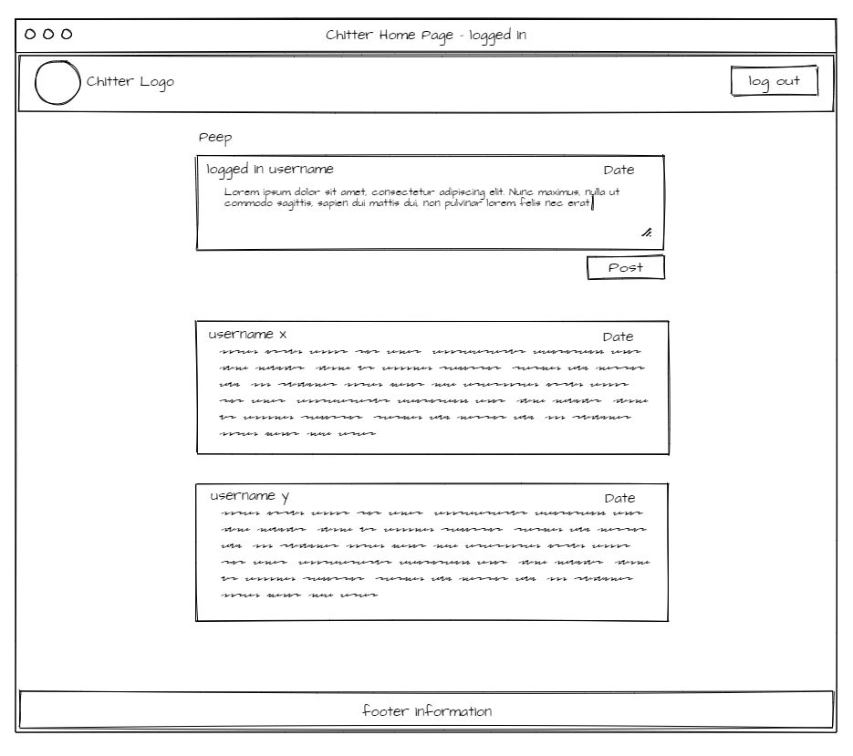
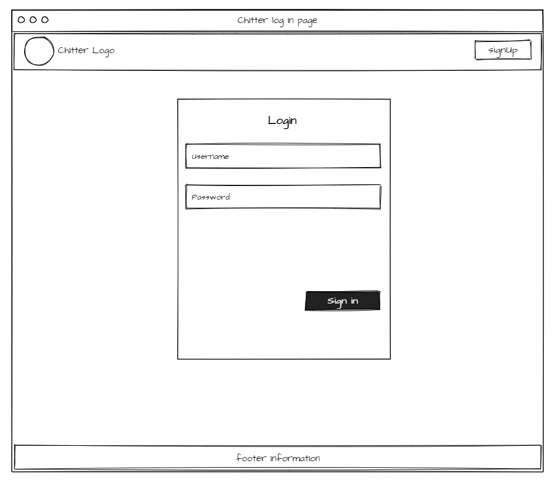
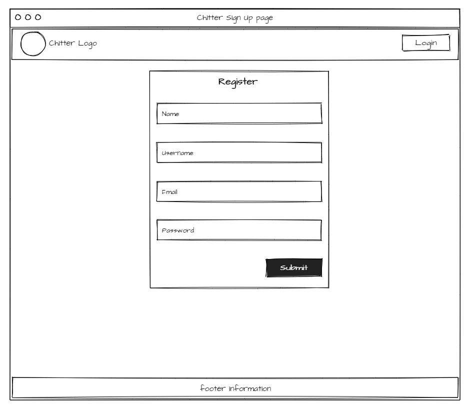

Chitter Challenge
=================

To start the application
* `cd server`
* `npm i` - to install dependencies (dotenv, nodemon, body-parser, cors, express, express validator, mongoose, chai, chai-http, mocha)
* `npm start` - to start the server
* Open another terminal window for the 
* `cd client`
* `npm i` - to install dependencies (jest, react, user-event, axios, bootstrap, react-dom, react-router-dom)
* `npm start` - to start the REACT app
* You can either click the link in the terminal or open "http://localhost:3000"
* Open another client terminal for testing
* `cd client`
* `npm test`
* `cd ..`
* `cd server`
* `npm test`

Challenge:
-------

As usual please start by forking this repo.

We are going to write a small twitter clone that will allow users to post messages to a public wall.

Good luck and let the chitter begin!

Features:
-------

### Standard Acceptance Criteria
```
As a trainee software engineer
So that I can let people know what I am doing  
I want to post a message (peep) to chitter

As a trainee
So that I can see what others are saying  
I want to see all peeps in reverse chronological order

As a trainee
So that I can better appreciate the context of a peep
I want to see the time at which it was made

As a trainee
So that I can post messages on Chitter as me
I want to sign up for Chitter

As a trainee
So that only I can post messages on Chitter as me
I want to log in to Chitter

As a trainee
So that I can avoid others posting messages on Chitter as me
I want to log out of Chitter
```

Additional requirements:
------

* You don't have to be logged in to see the peeps.
* Trainee software engineers sign up to chitter with their email, password, name and a username (e.g. ewithers@digitalfutures.com, password123, Edward Withers, dearshrewdwit).
* The username and email are unique.
* Peeps (posts to chitter) have the name of the trainee and their user handle.
* Your README should indicate the technologies used, and give instructions on how to install and run the tests.

### Extended Acceptance Criteria

```
As a trainee
So that I can stay constantly tapped in to the shouty box of Chitter
I want to receive an email if I am tagged in a Peep

As a trainee
In order to start a conversation as a DFA trainee Software Engineer
I want to reply to a peep from another trainee.
```


## Home page wireframe not logged in


### Component Hierarchy
>- App, Header, Peeps, Footer


## Home page wireframe logged in



### Component Hierarchy
>- App, Header, Post, Peeps, Footer


## Log in page



### Component Hierarchy
>- App, Header, LogIn, Footer


## Register page


### Component Hierarchy
>- App, Header, Register, Footer


### Schema for the peep & account:
>Looking at the requirements the peep needs to display what the name of the user is, the username and the time of the peep. This means that you probably want the peep to contain the name, username, the content of the peep, which would all be strings and a date created too which would be of the date type.

>The account should have a first name , last name, username, email, password where the username and email are unique.

### Route for the peeps:
>To be able to display the peeps I need a get request that looks for the schema of a peep in the database and then returns the data associated with that. Given that we need them to be in reverse chronological order, you don't actually need to make use of the time because when a peep is saved to a mongo db database it should create a mongodb _id associated to the peep. For this reason you could just sort them in opposite order which would be [_id:-1]. 

### Testing the peeps route:
>1. test if I make a get request and there are peeps available in hte database, it should return a successful response
>2. test if I make a get request and there are no peeps available, it should return a 404 error response
>When running the tests I ran into an error where, no matter if I cleared the database, I would still receive a status of 200. After some debugging I saw that the system wasn't actually checking if there are no peeps and would instead just return an empty body if the database was empty so I updated it to check for both an error and if the length of the peeps is 0 to know when to return a 404 status.

### Testing the peeps ( front end):
>1. test that for the single peep component, when rendering a component it displays each part of the peep
>2. test that for the multiple peeps, it renders the data for each peep

### Testing the API calls:
>1. test that the get api call is called with the link
>2. test that the post api call is called with the correct link

- When testing the api get call, I was unable to mock the setPeeps and setGetError functions that are passed into the api call so when it calls, it just returns an undefined. As such the only passing test I could do was if it calls the get method and if it calls the correct path.

### Route for registering the user:
>To be able to post the register, we need to make sure that the data fits the checks we want it to through the use of express-validator. Then if the username matches one already in the database it should direct the user to log in instead and if all fields pass the tests then it should post a new user to the accounts collection.

### Testing the registering route:
>1. test each scenario for missing data/ incorrect data to see that it returns the right response
>2. test that when you put in data that passes the validators and doesn't contain an already known username/email it passes and posts the data to the database

### Testing the registering component:
>1. test that when you render the register page, it displays the correct placeholders for each of the input boxes : firstname, secondname, username, email, password
>2. test that when you submit an account to be registered, it calls the eventhandler responsible for posting the data

### Route for logging in :
>When posting the log in details, we have to find one account where the email matches an email in a document and the password matches the password associated to that document. It should return a successful response if it finds the match and an unsuccessful one if it doesn't.

### Testing the login route:
>1. test that when you send login data that matches an email an password for a document in the database, it returns a successful response
>2. test that when you send login data with an email that doesn't match any in the database, it returns an unsuccessful response
>3. test that when you send login data with an email that matches one in the database but the password doesn't match the password for that document, it returns an unsuccessful response
>4. test that when you send login data with an email that doesn't pass the express validators ,it returns an error message specified for the email
>5. test that when you send login data with a password that doesn't pass the express validators, it returns an error message specified for the password

### Testing the login component:
>1. test that when you render the login page, it displays the correct placeholders for each of the input boxes : Email, Password
>2. test that when you submit details to log in, it calls t he eventhandler responsible for posting the data

### Updated Peep route to post a new peep:
>When posting the peep, we have to make sure the content of the peep is between 1 and 280 characters. It should return a successful response if it passes the test and saves the peep to the database.

### Testing the posting of a peep:
>1. test that when you send a peep to be saved that has content that fits the express validators, it returns a successful response
>2. test that when you send a peep to be saved that has content that doesn't match the express validators, it returns an unsuccessful response

### Testing the posting capability of the post component:
>1. test that when you render the peeps with the loggedIn state being true, it should conditionally render the post component
>2. test that when you enter a peep into the text box and click the submit button it calls the postPeepHandler

### Adding Header and Footer component:
> For the header, I wanted to conditionally render different buttons depending on if the user was logged in or not. If they were not, it should display a logout button on the right and if they are then it should display a login and sign up button. For the Footer I just wanted to display some static information

### Testing Header and Footer:
>1. If the loggedIn state is true then the header should display a logout button
>2. If the loggedIn state is false then the header should display a login and logout button
>3. The footer should render and match a snapshot


## Reflection:

### Difficulties:
- This challenge was indeed a challenge - pun intended. It was hard to remember everything I needed to do and the order in which it would be best to carry them out so I had to constantly have my other projects open to refer to. Often I would be stuck on a single error for multiple hours only for me to realise there was a typo in the data I was trying to input which flagged against the validator (meaning my code was working) because I wasn't reading correctly, or missing syntax that didn't give an error message that made it easy to find. Luckily as I went through, the flow got smoother between completing back-end and then the front-end.

### Changes I would make:
- In my search for ways to make it look as good as possible, I found myself very limited with bootsraps normal capabilities and didn't feel I had to the time to learn how to make use of their SASS function and we weren't allowed to make use of REACT bootstrap snippets. As such, in a next iteration, I would want to either make use of REACT bootstrap snippets to make it look cleaner or learn another styling tool like tailwind. - I Still need to improve my CSS capabilities.
- In terms of functionality, although everything seems to work and all the tests pass- one thing that I couldn't quite figure out was the logged in state changing when I log out. I ensured that I changed the state when the button was pressed and as such it would redirect me to the homepage with the logged out header to confirm that I was indeed logged out. However, if I were to press the log in button then, it wouldn't load the page and would redirect to the homepage after viewing the login for a brief second. This makes me think that the global state hasn't changed and as such is something that I would need to improve.
- Some things I could add to further this would be to attempt the extended criteria first and then from there possibly implement a liking function which notifies the user that posted the peep that the other user has liked it.